# OpenBao in cm-mayfly — Architecture, Lifecycle & Operations

OpenBao is the secret manager that backs cb-tumblebug's encrypted credential store (CSP credentials, namespaces, etc.). This document is the single source of truth for **how `mayfly` handles OpenBao end to end**: how it is initialized and unsealed, how the root token and unseal key flow through the system, how the token is injected into the dependent frameworks, how the state-consistency preflight diagnoses every situation, why the design ended up the way it did, and how to recover when something looks wrong.

> **⚠ The default auto-unseal is for development and testing only.** It keeps the unseal key in plaintext on disk. See [Security](#16-security--development--testing-only) before using it anywhere else.

> **⚠ Requires cb-tumblebug 0.12.25 or newer.** From 0.12.25 cb-tumblebug registers CSP credentials into OpenBao itself, using the `VAULT_TOKEN` from its own container environment — which it reads **once, at startup**. `mayfly` therefore verifies that token through cb-tumblebug's `GET /credential/openbaoStatus` (signal **C** in [§6](#6-state-consistency-preflight)), an endpoint that does not exist before 0.12.25. **No compatibility fallback is kept**: silently skipping the check on an older server would hide exactly the failure the check exists to catch — a container holding a stale token, registering credentials into nowhere, while every other signal looks healthy. Running this version of `mayfly` against cb-tumblebug below 0.12.25 is not supported. See [§13](#13-relationship-with-cb-tumblebugs-openbao-init).

- [1. Overview & mental model](#1-overview--mental-model)
- [2. Architecture — the dependency chain](#2-architecture--the-dependency-chain)
- [3. Token & key handling](#3-token--key-handling)
- [4. Scenarios — what happens, case by case](#4-scenarios--what-happens-case-by-case)
- [5. How each stage handles OpenBao](#5-how-each-stage-handles-openbao)
- [6. State-consistency preflight](#6-state-consistency-preflight)
- [7. Why mayfly guides instead of auto-repairing](#7-why-mayfly-guides-instead-of-auto-repairing)
- [8. Commands](#8-commands)
- [9. Behavior by situation (verified)](#9-behavior-by-situation-verified)
- [10. Recovery & troubleshooting](#10-recovery--troubleshooting)
- [11. Design rationale — how this design was reached](#11-design-rationale--how-this-design-was-reached)
- [12. FAQ](#12-faq)
- [13. Relationship with cb-tumblebug's openbao-init](#13-relationship-with-cb-tumblebugs-openbao-init)
- [14. Auto-unseal sidecar — a default, not a requirement](#14-auto-unseal-sidecar--a-default-not-a-requirement)
- [15. Unseal key shares (Shamir threshold) — the current limit](#15-unseal-key-shares-shamir-threshold--the-current-limit)
- [16. Security — development / testing only](#16-security--development--testing-only)

---

## 1. Overview & mental model

OpenBao is **initialized once** — an unseal key and a root token are generated and saved — and after that it comes up **sealed on every restart**. A sealed OpenBao answers most API calls with `503` and cannot serve secrets until it is **unsealed**. Once unsealed it also needs a brief moment to become **active** (mount table loaded, leadership settled) before it truly serves requests.

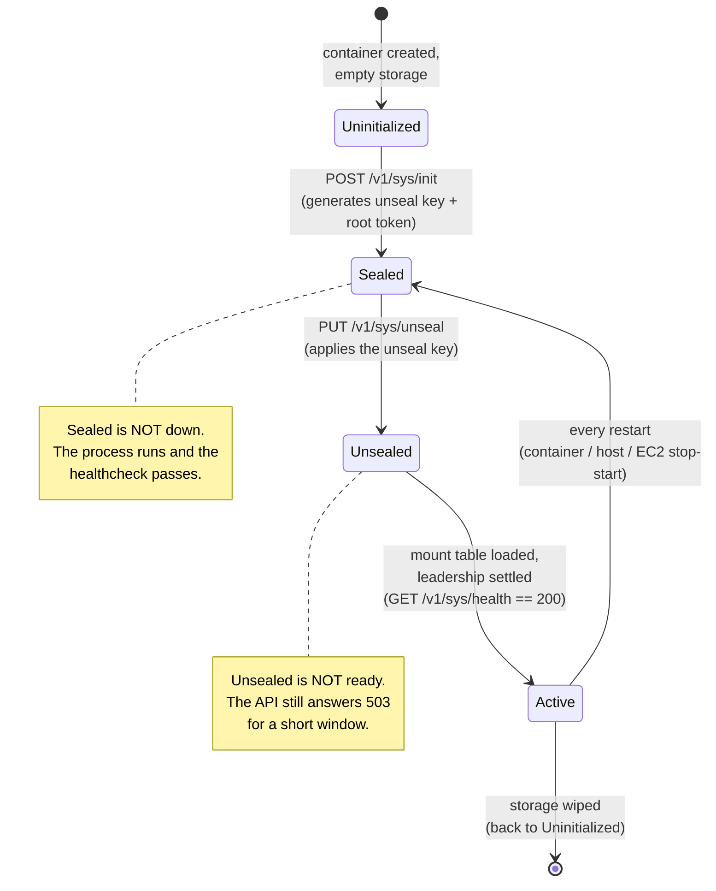

Three facts drive everything below:

1. **Two secrets, two jobs.** The **unseal key** turns a sealed OpenBao into an unsealed one. The **root token** authenticates API calls. Both are produced at init time and saved in `openbao-init.json`.
2. **Sealed ≠ down, and unsealed ≠ active.** `sealed:false` from `seal-status` does not yet mean "ready to serve" — the correct readiness signal is `GET /v1/sys/health` returning `200` (initialized + unsealed + active).
3. **The dependent frameworks need the token, not the key.** cb-tumblebug and mc-terrarium receive the **root token** via the `VAULT_TOKEN` environment variable; they never see the unseal key.

`mayfly` provides two layers:

- **Explicit commands** (stable baseline): `mayfly setup openbao init | unseal | status`.
- **Automatic handling** (dev/test convenience): `mayfly infra run` auto-initializes on a clean install, and the `openbao-unseal` sidecar re-unseals OpenBao whenever it is found sealed. In normal use you run no unseal command yourself.

---

## 2. Architecture — the dependency chain

`mayfly infra run` mirrors the upstream cb-tumblebug `make up` **staged flow** so the dependent containers never freeze with an empty token:

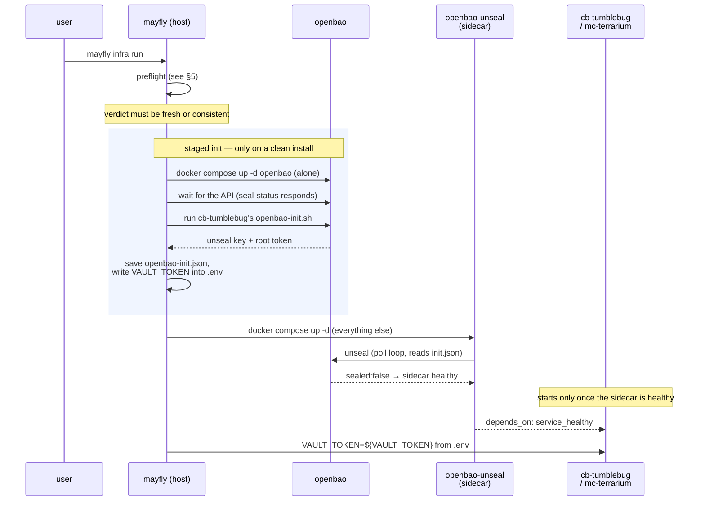

The compose dependency chain and its health semantics:

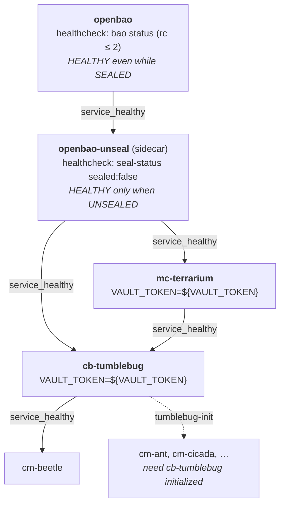

Two health-semantic subtleties that matter:

- **`openbao` is reported healthy even when sealed** (`bao status` exits `2` when sealed, and the check accepts `rc ≤ 2`). That is deliberate: it lets the sidecar depend on `openbao: service_healthy` and then do the unsealing itself.
- **`openbao-unseal` is healthy only when OpenBao is actually unsealed** (`sealed:false`). This is why `mc-terrarium` and `cb-tumblebug` depend on the *sidecar*, not on `openbao` — depending on the sidecar guarantees they only start once OpenBao is unsealed.

---

## 3. Token & key handling

### 3.1 Where each secret lives

| Secret | Produced by | Stored at | Used by |
|--------|-------------|-----------|---------|
| **Unseal key** (`keys[]` / `keys_base64[]`) | `POST /v1/sys/init` at init time | `conf/docker/data/openbao/secrets/openbao-init.json` (chmod 600) | `mayfly setup openbao unseal` and the `openbao-unseal` sidecar, to unseal |
| **Root token** (`root_token`) | same init call | same `openbao-init.json` **and** copied into `conf/docker/.env` as `VAULT_TOKEN` | API authentication; injected into cb-tumblebug / mc-terrarium |

Secrets are always **masked** in any human-facing output (first 8 characters + `***`). The unseal key is never returned by the API and never printed.

Because the root token is stored in **two** places — `openbao-init.json` (the durable copy) and `.env` (the copy the containers consume) — the `.env` copy is **recoverable**: if it is lost or overwritten, it can be restored from `openbao-init.json` without re-initializing OpenBao and without losing any encrypted data. The preflight detects exactly this situation (`lost-token`) and prints the masked value to restore. See [§10](#10-recovery--troubleshooting).

### 3.2 Token flow (init → .env → containers)

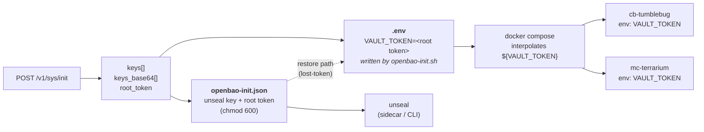

The dependent containers read `VAULT_TOKEN` **from their environment at container-create time**. A container created *before* `.env` was populated will hold an empty token even though `.env` now has one — the fix is to recreate just that container (`mayfly setup openbao status` prints the exact command).

### 3.3 Key injection into the frameworks

Only the **root token** is injected, and only into the two frameworks that talk to OpenBao:

- **cb-tumblebug** — uses the token to read/write encrypted CSP credentials in the secret store.
- **mc-terrarium** — uses the token for its own secret access.

No other framework receives the token, and none of them ever receive the unseal key. If a framework shows an empty `VAULT_TOKEN` while `.env` has one, it is a container-recreate problem, not a key problem.

---

## 4. Scenarios — what happens, case by case

This section walks through every OpenBao-related situation you can hit, in the order you are likely to hit them. Each one shows the flow and what it does to the **four artifacts** that hold all the state.

### 4.0 The four artifacts

Everything below is a story about these four things. If you know their state, you know your situation.

| # | Artifact | Holds | Who writes it |
|---|----------|-------|---------------|
| **T** | `conf/docker/.env` → `VAULT_TOKEN` | the root token the **containers** consume | `openbao-init.sh` (on init); `infra remove --clean-all` (clears it); **you** (on restore) |
| **J** | `conf/docker/data/openbao/secrets/openbao-init.json` | the **unseal key** + the durable copy of the **root token** | `openbao-init.sh` (on init) |
| **D** | `conf/docker/data/openbao/data/` | the **encrypted storage** (CSP credentials, namespaces) | OpenBao itself |
| **C** | container env of cb-tumblebug / mc-terrarium | a **snapshot of T taken at container-create time** | `docker compose` interpolation |

The single most important property: **C is a snapshot, not a live reference.** Changing `.env` does nothing to a container that is already running — it must be recreated. Every "token looks right but it doesn't work" problem traces back to this.

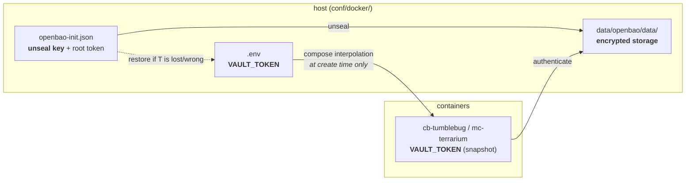

---

### 4.1 First install — `mayfly infra run` on a clean host

Nothing exists yet: **T empty, J absent, D empty**. The preflight calls this **C1 fresh**, and it is the one case `mayfly` fixes automatically — there is no existing data to endanger, so there is nothing to ask about.

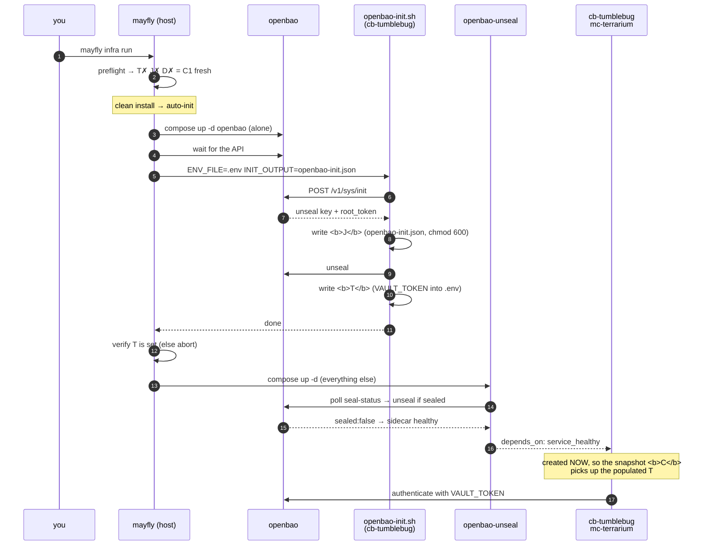

| Artifact | Before | After |
|----------|--------|-------|
| **T** `.env` `VAULT_TOKEN` | empty | **set** (root token) |
| **J** `openbao-init.json` | absent | **created** (unseal key + root token) |
| **D** storage | empty | **initialized** (empty but valid) |
| **C** container env | — | **set** (snapshot of T) |

**Why openbao is started alone first.** `depends_on` flows dependent → dependency, so `compose up -d openbao` pulls in nothing else. If the whole stack were started in one shot, compose would interpolate `${VAULT_TOKEN}` from an `.env` that has not been written yet, and cb-tumblebug/mc-terrarium would be created holding an **empty** token — running, healthy-looking, and unable to touch a single secret. Staging makes that window impossible instead of recoverable.

> The stack is now up, but **no CSP credentials are registered yet**. That is [§4.6](#46-registering-credentials--mayfly-setup-tumblebug-init).

---

### 4.2 Restart — container restart, host reboot, EC2 stop-start

**OpenBao comes back sealed every single time.** Its storage (D) and the key file (J) survive; `.env` (T) is untouched. The only thing that must happen is an unseal — and that is exactly what the sidecar is for.

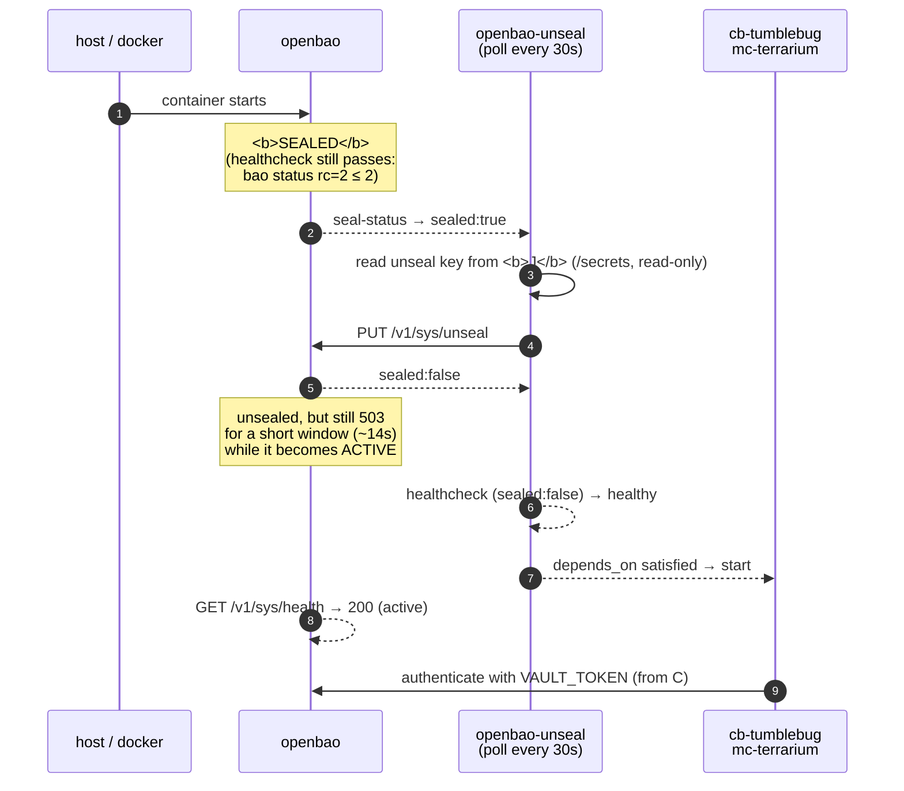

| Artifact | Before | After |
|----------|--------|-------|
| **T** | set | **unchanged** |
| **J** | present | **unchanged** (read-only to the sidecar) |
| **D** | initialized | **unchanged** |
| **C** | set | **unchanged** if containers only restarted; re-snapshotted from T if recreated |

**No `mayfly` command is involved.** Recovery here is compose + sidecar. Nothing writes anything.

**If the sidecar is disabled**, OpenBao stays sealed and nothing starts behind it. Run `mayfly setup openbao unseal` by hand — same code path, same result. See [§14.2](#142-turning-it-off-manual-mode).

> **Why this scenario drives the whole design.** Dev and demo hosts are stopped overnight to save cost, so *every working day starts here*. A sealed OpenBao is not an obvious failure — cb-tumblebug keeps answering, only its direct-CSP path quietly degrades — so an environment that needs a manual unseal after each restart spends a lot of its life subtly broken without anyone noticing.

---

### 4.3 Every later `mayfly infra run`

T, J, and D all exist and agree. The preflight confirms it (**C2 consistent**) and gets out of the way.

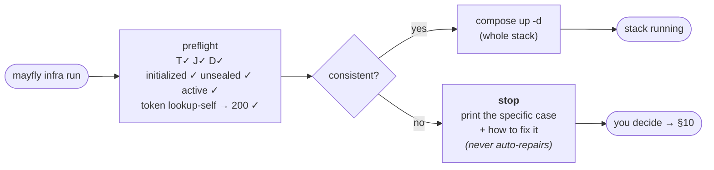

**Nothing is initialized and nothing is written.** Re-running `infra run` on a healthy environment is safe and idempotent.

---

### 4.4 Checking state — `mayfly infra info` and `mayfly setup openbao status`

Both are **read-only**. They never start OpenBao, never unseal, never write. They run the same preflight (in read-only mode) and report the same verdict; they differ only in how much they print.

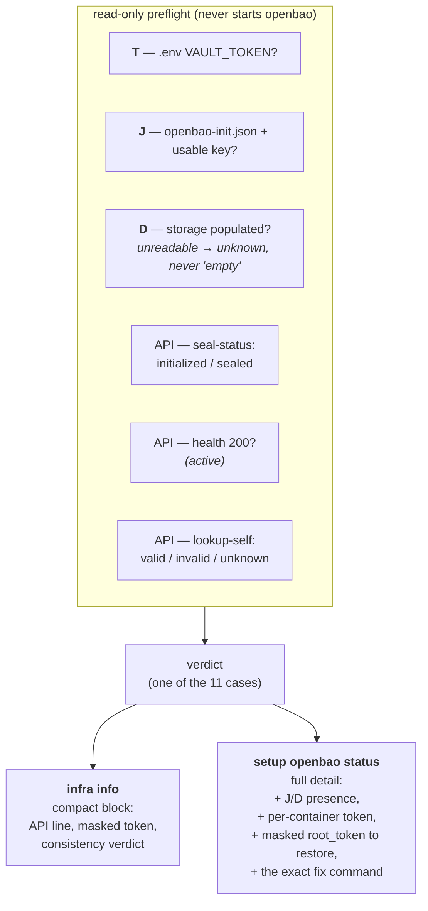

`infra info` answers *"is OpenBao OK?"* in one line inside the wider stack summary. `setup openbao status` answers *"what exactly is wrong and what do I type?"*. **When something looks wrong, always start with `setup openbao status`.**

Note the read-only mode uses a **short** readiness bound: if OpenBao is up but not yet active, `status`/`info` report `not-ready` rather than hanging for 30 seconds.

---

### 4.5 The `mayfly setup openbao` commands

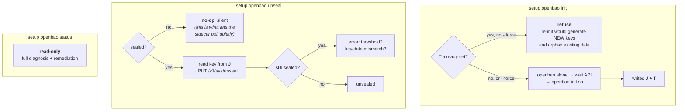

| Command | Writes anything? | When you need it |
|---------|:---:|------------------|
| `setup openbao init` | **yes** — creates J, writes T | Rarely by hand — `infra run` does it on a clean install. Use it for explicit control. |
| `setup openbao init --force` | **yes — destructive** | Only after wiping D. It generates a **new** unseal key + root token; anything still encrypted under the old ones becomes unreadable. |
| `setup openbao unseal` | no | Only when the sidecar is disabled, or you want to unseal immediately instead of waiting one poll interval. |
| `setup openbao status` | no | Any time something looks wrong. Start here. |

The `unseal` command and the sidecar run **the same code**. The sidecar just calls it in a loop with container paths (`--file /secrets/openbao-init.json --addr http://openbao:8200`). Because it is a silent no-op when already unsealed, polling it costs nothing and keeps the logs quiet.

---

### 4.6 Registering credentials — `mayfly setup tumblebug-init`

This is where the token is finally *used* for real work: CSP credentials are decrypted and registered, and cb-tumblebug stores them in OpenBao.

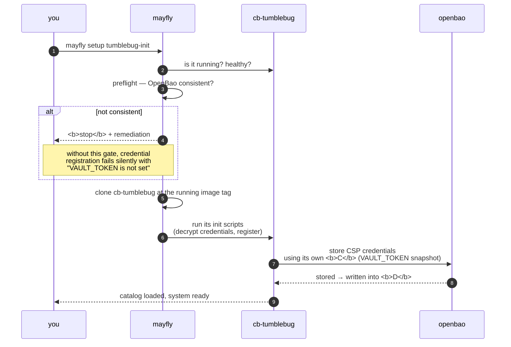

| Artifact | Effect |
|----------|--------|
| **T / J** | unchanged |
| **D** | **CSP credentials written** — from here on, D holds data you do not want to lose |
| **C** | *consumed* — this is the step that proves the container's token snapshot is actually valid |

**This is the moment the preflight gate earns its keep.** If OpenBao is sealed, uninitialized, or the container is holding a stale token, registration does not fail loudly — it half-succeeds, and you discover it much later when a CSP call takes a fallback path. The gate stops it up front.

> After this step, `infra remove --clean-all` becomes genuinely destructive: it deletes D. Use `--clean-db` if you want to keep the credentials.

---

### 4.7 Removal — `remove`, `--clean-db`, `--clean-all`

The three levels differ **exactly** in what they do to T and D. That is the whole distinction.

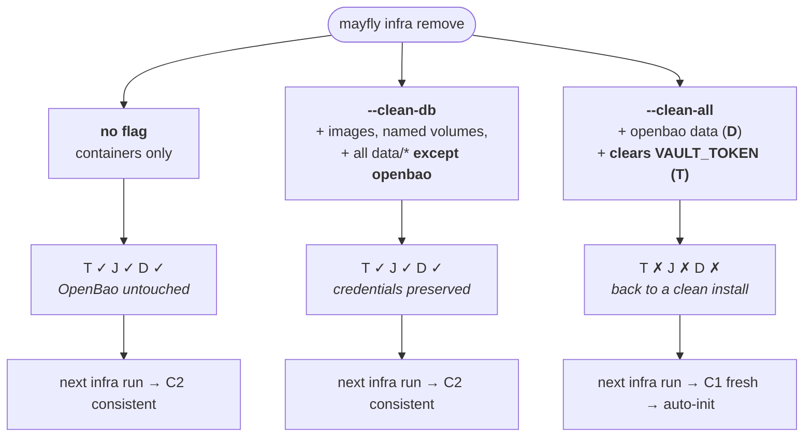

| | containers | images / volumes | other `data/*` | **D** openbao data | **T** `.env` token | **J** init.json |
|---|:---:|:---:|:---:|:---:|:---:|:---:|
| `remove` | removed | kept | kept | kept | kept | kept |
| `remove --clean-db` | removed | removed | removed | **kept** | **kept** | kept |
| `remove --clean-all` | removed | removed | removed | **removed** | **cleared** | removed |

**Why `--clean-all` clears the token, and why that matters.** It used not to — and that was a real bug. It deleted D but left T set, so the next `infra run` saw a token, concluded OpenBao was already set up, **skipped auto-init**, and brought up an uninitialized OpenBao behind a stale token. The stack deadlocked in a way that looked like a code regression. Clearing T is what makes "wipe everything" actually return you to the clean-install path of [§4.1](#41-first-install--mayfly-infra-run-on-a-clean-host).

> If you delete `data/openbao/` **by hand** instead of using `--clean-all`, you land in exactly that old broken state: **T set, D gone**. The preflight names it `orphaned-token` and tells you to clear `VAULT_TOKEN`. See below.

---

### 4.8 Broken states — every case, and what mayfly does

Any combination of T / J / D that does not agree is a *named* case with a *specific* remediation. `mayfly` **stops and explains — it never repairs on its own** (why: [§7](#7-why-mayfly-guides-instead-of-auto-repairing)).

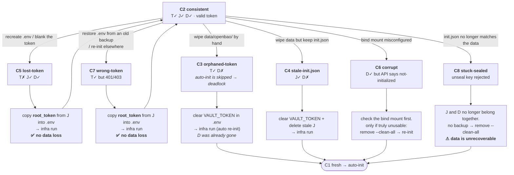

The two cases you are most likely to hit — **`lost-token`** and **`wrong-token`** — are both **fully recoverable with no data loss**, because the root token has a durable second copy in `openbao-init.json`. `mayfly` prints the masked value and the exact steps. See [§10.1](#101-restoring-the-root-token-no-data-loss).

There is also **`not-ready`** (unsealed but the API has not become active yet). It is *not* a broken state — it is a transition. Wait a few seconds and re-run. It exists as a distinct verdict precisely so a transient `503` can never be reported as a wrong token.

---

## 5. How each stage handles OpenBao

| Stage | What it does with OpenBao |
|-------|---------------------------|
| **`mayfly infra run`** (full stack) | Runs the [state-consistency preflight](#6-state-consistency-preflight) first. On a clean install (no token, no data) it auto-runs `init` (staged flow above). On a consistent existing setup it proceeds. On any inconsistency it prints the specific remediation and **stops before starting the rest**, so the stack never deadlocks half-up. |
| **`mayfly infra run -s <svc>`** (targeted) | Runs a **read-only** readiness check when the targeted services use OpenBao (they declare `VAULT_*` in compose, e.g. cb-tumblebug, mc-terrarium). It never auto-inits or auto-starts OpenBao — that would be surprising for a targeted start — but if OpenBao is not usable it prints what to run (`mayfly setup openbao init`, or the full `mayfly infra run`) and **stops** rather than starting services that would fail on their first secret lookup. Targets that do not use OpenBao are not gated. `mayfly infra update -s <svc>` behaves the same. |
| **`mayfly setup openbao init`** | One-time init (staged: openbao alone → wait API → `openbao-init.sh`). Refuses without `--force` if `VAULT_TOKEN` is already set (re-init would orphan existing encrypted data). |
| **`mayfly setup openbao unseal`** | Reads the saved unseal key and unseals. No-op if already unsealed. |
| **`mayfly setup openbao status`** | Read-only diagnosis (never starts OpenBao). Prints the full signal set + verdict. |
| **`mayfly setup tumblebug-init`** | Requires cb-tumblebug running + the preflight verdict to be OK (openbao consistent) before registering credentials — otherwise credential registration silently fails with "VAULT_TOKEN is not set". |
| **`mayfly infra info`** | Embeds a compact read-only OpenBao consistency summary (same verdict as `status`). |
| **`mayfly infra remove --clean-db`** | Removes containers/images/volumes and DB host data, **but preserves the OpenBao host data and the `.env` VAULT_TOKEN**. A subsequent `infra run` reuses the existing OpenBao (consistent path). |
| **`mayfly infra remove --clean-all`** | Everything `--clean-db` does **plus** the OpenBao host data, and it **clears `VAULT_TOKEN` from `.env`** so the next `infra run` performs a clean auto-init instead of failing on a stale token. |
| **Host reboot / container restart / SIGKILL** | OpenBao comes back sealed; the sidecar re-unseals it. No `mayfly` action is involved — recovery is compose + sidecar. |

---

## 6. State-consistency preflight

Before `infra run`, `tumblebug-init`, and `openbao status` act, a shared **preflight** in `internal/openbao` collects the state signals and returns one authoritative verdict, so all entry points share one judgement. It is **detection/diagnosis only — it never writes `.env` and never destroys data.** When it finds a mismatch it returns a masked, actionable remediation message. The reasoning behind that choice is in [§7](#7-why-mayfly-guides-instead-of-auto-repairing).

### 6.1 Signals

| Signal | Meaning | Source |
|--------|---------|--------|
| **T** | `.env` has a non-empty `VAULT_TOKEN` | `conf/docker/.env` (no network) |
| **J** | `openbao-init.json` present with a usable unseal key | disk |
| **D** | OpenBao storage directory holds data | disk (unreadable → *unknown*, never assumed empty) |
| **A** | API reports `initialized` | `GET /v1/sys/seal-status` |
| **Sealed** | API reports `sealed` | `GET /v1/sys/seal-status` |
| **Active** | API reached **`health 200`** (initialized + unsealed + **active**) | `GET /v1/sys/health` |
| **V** | Token validity — **valid / invalid / unknown** | `GET /v1/auth/token/lookup-self` |
| **C** | The token the **running cb-tumblebug holds** — **valid / invalid / unknown** | cb-tumblebug `GET /credential/openbaoStatus` (it runs `lookup-self` with its own container token) |

**Readiness gate (the key ordering).** After bringing OpenBao up and unsealing it, the preflight waits for **`health 200` (active)** *before* it checks the token. Right after an unseal, OpenBao spends a short window (seconds) still answering `503` while it loads its mount table / settles leadership — see the measured ~14 s window in [§9](#9-behavior-by-situation-verified). Gating on `health 200` absorbs that window as **infrastructure readiness**, so a transition-window `503` can never be mistaken for a bad token. Only after readiness is confirmed does the token check run.

**Token is tri-state.** Because readiness is guaranteed upstream, the token probe returns:

- **valid** — `200`.
- **invalid** — `401` / `403` (a genuine wrong/stale token).
- **unknown** — a residual transient (`5xx` / timeout / connection error) that persists after a short retry. Unknown is **non-blocking**: the stack proceeds with an informational note rather than being flagged as a wrong token.

**Why the host signals are not enough (signal C).** T–V all look at the host: the `.env` file, the files on disk, and OpenBao's own API. None of them can see *inside* a running container. Since cb-tumblebug 0.12.25 the credential registration is done **by the cb-tumblebug server**, with the token it read from its environment **at startup** — so a container that was started before the current token keeps the old one, registration fails silently, and **every host signal still reports a healthy, consistent stack**. Signal **C** closes that gap by asking cb-tumblebug itself whether the token it holds is still accepted.

C is tri-state too, and deliberately hard to push into *invalid*:

- **valid** — cb-tumblebug reports `tokenValid: true`.
- **invalid** — cb-tumblebug reports that OpenBao is reachable, initialized and unsealed, yet its token is missing or rejected. That isolates the container's token as the fault.
- **unknown** — anything else: cb-tumblebug is not healthy yet, the request fails, or the answer blames **OpenBao itself** (unreachable / not initialized / sealed). The last one matters: a sealed OpenBao also yields `tokenValid: false`, but that is not a container-token fault — signals A and V already diagnose it as `stuck-sealed` or `corrupt`. Reporting it here as well would name one fault twice and send you after the wrong fix.

A **readiness gate** applies to C as well: if the cb-tumblebug container is not running and healthy, C is not probed at all (→ unknown). Unknown never blocks.

### 6.2 Decision flow

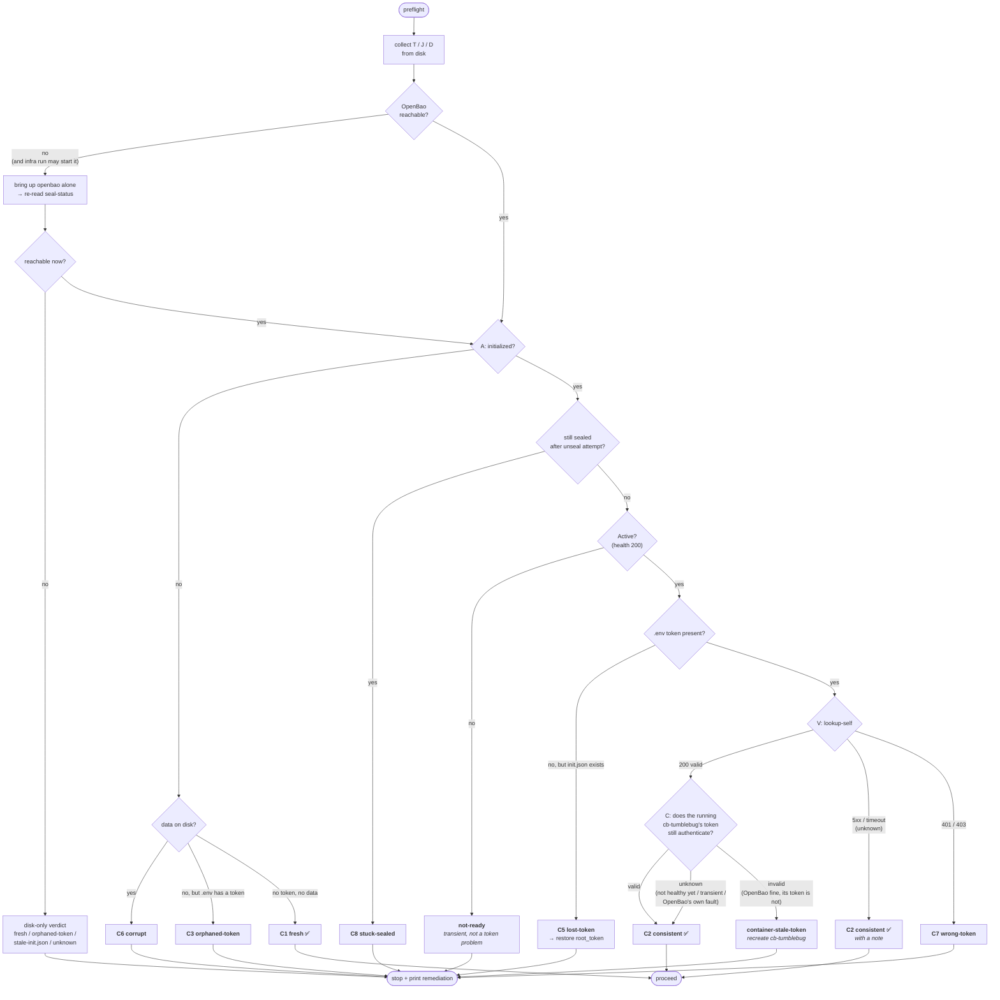

### 6.3 Verdict cases

| Case | Meaning | `infra run` behavior |
|------|---------|----------------------|
| **C1 fresh** | no token, no data | auto-init, then start the rest |
| **C2 consistent** | token + data + initialized + unsealed + **active** + **valid** token | proceed |
| **C3 orphaned-token** | token present but storage wiped | stop; guidance to clear `VAULT_TOKEN` (or `--clean-all` then re-init) |
| **C4 stale-init.json** | `init.json` present but storage wiped | stop; guidance to clear token + remove stale `init.json` |
| **C5 lost-token** | storage + `init.json` intact, only `.env` token missing | stop; guidance to restore `root_token` into `.env` |
| **C6 corrupt** | data on disk but API says not-initialized | stop; check mount / re-init if truly unusable |
| **C7 wrong-token** | token present but authentication **confirmed** `401/403` | stop; guidance to restore the correct `root_token` |
| **C8 stuck-sealed** | initialized but stays sealed after an unseal attempt | stop; unseal key likely does not match the data |
| **container-stale-token** | every host signal is healthy, but the **running cb-tumblebug** holds a token OpenBao rejects (it was started before the current token) | stop; guidance to recreate the container — `docker compose up -d cb-tumblebug`, **no data loss** |
| **not-ready** | unsealed but the API never reached `health 200` within the bound | stop; transient — wait a moment and retry |
| **unknown** *(disk path)* | OpenBao down and disk signals ambiguous | non-fatal; points to `setup openbao status` |
| **token-unknown** *(reachable)* | active, but token validity could not be confirmed (residual transient) | **proceed** with a note (not treated as wrong-token) |

> Only **C1** and **C2** (and the non-blocking token-unknown variant of C2) are "OK to proceed". Every other case carries a specific remediation and stops the caller before the stack can deadlock.

---

## 7. Why mayfly guides instead of auto-repairing

The preflight can *detect* every case in the table above, and in most of them it also knows the exact value that would fix the problem — for `lost-token` it is literally holding the correct `root_token` in `openbao-init.json`. It still does **not** write it. It prints the masked value, names the file and the field, and stops.

This is deliberate. The reasons, in order of weight:

**1. Every automatic "fix" is destructive in the case where the diagnosis is wrong.** The repair for `orphaned-token` is to clear `VAULT_TOKEN`, which lets the next `infra run` re-initialize OpenBao — generating a **new** unseal key and root token, and permanently orphaning whatever was encrypted with the old ones. If the storage was in fact fine and only *looked* empty, that auto-repair has destroyed real CSP credentials. The blast radius of a wrong repair is far larger than the cost of stopping and asking.

**2. The signals are necessarily incomplete, and the code knows it.** The data directory is owned by the OpenBao user inside the container (UID 100), so from the host it can be *unreadable* rather than empty. The preflight therefore treats "cannot read" as **unknown**, never as "no data". Acting automatically on an ambiguous signal is precisely how storage gets wiped by a tool that was trying to help.

**3. `.env` is the user's file and `VAULT_TOKEN` is the user's secret.** Silently rewriting a secret in someone's environment file is a bad default even when the new value is correct. It also hides the event: the user never learns that their environment had drifted, so the underlying cause (a stale snapshot, a half-restored backup, a manual edit) goes uninvestigated and recurs.

**4. `openbao init --force` must stay a human gate.** It is the one command that can destroy access to existing encrypted data. If the preflight were allowed to repair state on its own, there would be a path — however indirect — from "run the normal command" to "keys regenerated". Keeping repair manual means that path does not exist.

**5. Stopping early is cheaper than a half-up stack.** A wrong auto-repair does not fail loudly; it produces a system that *looks* healthy. A sealed or mis-tokened OpenBao does not crash cb-tumblebug — cb-tumblebug keeps answering, but its direct-CSP path silently degrades to a fallback, cm-ant restarts in a loop, and the symptoms surface far from the cause. Refusing to start the rest of the stack turns a confusing multi-service failure into one clear message at the point of origin.

So the contract is: **detect precisely, explain exactly** — which file, which field, which value, which command — **and let the human decide.** The commands that *do* change state (`init`, `init --force`, `unseal`, `remove --clean-all`) are all explicit, and each one says what it will destroy before it does it.

The one exception is the clean-install path: on **C1 fresh** (no token, no data, nothing to lose) `infra run` initializes automatically. There is no ambiguity and no existing data to endanger, so there is nothing to ask about.

---

## 8. Commands

| Command | What it does |
|---------|--------------|
| `mayfly setup openbao status` | One-screen summary: API reachable / initialized / sealed / **active**, token validity (**valid / unknown / INVALID**), `.env` token (masked), `init.json` + data-volume presence, whether cb-tumblebug and mc-terrarium picked up the token, the overall consistency verdict, and notes that suggest the matching fix. **Start here when something looks wrong.** |
| `mayfly setup openbao unseal` | Read the saved unseal key and unseal OpenBao. No-op if already unsealed. |
| `mayfly setup openbao init` | One-time initialization (writes `VAULT_TOKEN` into `.env`). `mayfly infra run` calls this automatically on a clean install, so you rarely run it by hand. Re-initializing requires `--force` and **destroys access to existing encrypted data**. |
| `mayfly infra info` | Among other things, shows the compact OpenBao consistency block (read-only). |

---

## 9. Behavior by situation (verified)

With the default (sidecar enabled) configuration. The last column notes real-environment verification.

| Situation | OpenBao after the event | Auto-recovery | Action needed | Verified |
|-----------|-------------------------|:-------------:|---------------|----------|
| Clean install (`infra run`) | initialized + unsealed + active | yes — init + unseal run automatically | none | ✅ C1 fresh → `consistent`/`valid` |
| `infra run` on an existing setup | consistent | yes | none | ✅ C2 |
| `infra stop` / `docker compose down` then `infra run` | recreated, sealed → unsealed | yes — sidecar / staged run | none | ✅ proceeds through the transition |
| **OpenBao container restart** | sealed → unsealed | yes — sidecar re-unseals; **the API answers `503` for a bounded window** (measured ~14 s) | none | ✅ readiness gate waits through it; `infra run` proceeds (~13 s), **no false wrong-token** |
| **Host reboot / EC2 stop-start** | sealed → unsealed | yes — sidecar re-unseals after containers return | none | ✅ `health 200` ~3 s after boot; status `consistent/valid` |
| **Forced crash (`SIGKILL`)** | down (no auto-restart after a manual kill) | recover with `infra run` | `mayfly infra run` | ✅ status shows `unknown / not running` (correct), then recovers to `consistent` |
| Wrong / stale `.env` token | active but token `403` | no | restore the correct `root_token` | ✅ `INVALID (401/403)` / `wrong-token` — **not** masked as transient |
| `.env` token empty, data intact | active, token empty | no | restore `root_token` into `.env` | ✅ `lost-token` with restore advice |
| Remove `-s cb-tumblebug --clean-db` then reinstall | OpenBao preserved | yes | none | ✅ cb-tumblebug healthy in ~12 s; OpenBao stays `consistent` |
| `init.json` missing / unreadable | sealed; cannot unseal | no — sidecar logs the reason, no crash | restore the file | (unit-tested) |
| Sidecar disabled (manual mode) | sealed after any restart | no | `mayfly setup openbao unseal` | — |

In short: with the sidecar enabled, **every restart path — container restart, host reboot, EC2 stop-start — recovers on its own**, and the preflight waits out the post-unseal `503` window instead of misreading it. The cases that need a human are a missing/disabled unseal key (C8) or a genuinely wrong token (C7), and the commands above are exactly for those.

---

## 10. Recovery & troubleshooting

Always **diagnose first**: `mayfly setup openbao status`, then apply the matching fix.

| `status` shows | Cause | Fix |
|----------------|-------|-----|
| `sealed=true` | OpenBao came up sealed and the sidecar hasn't unsealed yet (or is disabled) | `mayfly setup openbao unseal` (or wait one poll interval) |
| `consistency: not-ready` | unsealed but the API is still becoming active | transient — wait a few seconds and re-run |
| `token validity: INVALID (401/403)` (`wrong-token`) | `.env` `VAULT_TOKEN` doesn't match the current OpenBao | restore the `root_token` (see below), then `infra run` |
| `token validity: unknown` | OpenBao returned a transient error; validity couldn't be confirmed | usually harmless — re-run `status`; the stack is not blocked on this |
| `consistency: lost-token` | data + `init.json` intact, `.env` token empty | restore the `root_token` (see below), then `infra run` |
| `consistency: orphaned-token` / `stale-init.json` | token/`init.json` present but storage was wiped | clear `VAULT_TOKEN` (and remove stale `init.json`), then `infra run` — or `infra remove --clean-all` then re-init |
| `initialized=false` with data on disk (`corrupt`) | possible mount misconfig | check the bind mount; if the data is truly unusable, `infra remove --clean-all` then re-init |
| a container shows `VAULT_TOKEN (empty)` while `.env` has one | that container started before `.env` was populated | recreate just that container (the `status` note prints the command) |

### 10.1 Restoring the root token (no data loss)

This is the fix for both **`lost-token`** (the `.env` value is empty) and **`wrong-token`** (the `.env` value is stale). **It does not re-initialize OpenBao and does not touch the encrypted data** — it only puts the correct token back where the containers can read it.

The durable copy of the token lives in the init file, next to the unseal key:

```text
conf/docker/data/openbao/secrets/openbao-init.json
```

1. Read the `root_token` field from that file. `mayfly setup openbao status` also prints it **masked** (first 8 characters), so you can confirm you are copying the right value without exposing it in your terminal history.
2. Put it into `conf/docker/.env`:
   ```
   VAULT_TOKEN=<root_token from openbao-init.json>
   ```
3. Re-run `mayfly infra run`. The dependent containers are recreated with the restored token and the preflight verdict returns to `consistent`.

`mayfly` prints these steps for you, with the masked value filled in, whenever the preflight lands on `lost-token` or `wrong-token`. It does **not** perform the edit itself — see [§7](#7-why-mayfly-guides-instead-of-auto-repairing).

If the token in `openbao-init.json` is *also* rejected, then the key material and the storage no longer belong to each other (for example, the data directory was restored from a different backup than the init file). At that point the encrypted data is unrecoverable and the only path forward is `mayfly infra remove --clean-all` followed by a fresh init — which is exactly why that command is explicit and destructive by declaration.

---

## 11. Design rationale — how this design was reached

The current shape (host-side init, a sidecar that only unseals, a preflight that only advises) was not designed up front. Each piece exists because a specific failure was hit in a real environment. This section records that path, so the next change does not re-break a solved problem.

**Start: init on the host, because the token must exist before the consumers start.**
The dependent containers read `VAULT_TOKEN` from their environment **once, at container-create time**. If the stack is brought up in one shot, `docker compose` interpolates `${VAULT_TOKEN}` from a `.env` that OpenBao has not filled in yet, and cb-tumblebug/mc-terrarium freeze with an empty token — they are running, they look healthy, and every secret access fails. The first attempt at fixing this was to *restart* the two containers after init had written the token. That works, but it is a repair after the fact. It was replaced by the **staged flow** (openbao alone → init → everything else), which mirrors upstream cb-tumblebug's `make up` and makes the empty-token window impossible rather than recoverable. Init therefore lives on the host, in the CLI, and runs **before** the stack — not inside a container that would have to reach back out and mutate the host's `.env`.

**Then: the sidecar, because unseal is not a one-time event.**
OpenBao comes back **sealed on every restart**. The first sidecar was a one-shot: it unsealed once at first start and exited. That is fine for a fresh install and useless afterwards — after a container restart, a host reboot, or an EC2 stop-start, OpenBao was sealed again and nothing unsealed it. It was converted into a **continuous watcher** that polls and re-unseals whenever it finds OpenBao sealed. Unseal is a good fit for a sidecar precisely *because* it is stateless and idempotent: it needs the unseal key and nothing else, it does not touch `.env`, it does not need a Docker socket, and running it twice is a no-op.

**Then: parse the init file properly, in Go, not with shell text tools.**
The sidecar originally scraped `openbao-init.json` with `grep`, and it was scraping for the wrong field name — the REST `POST /v1/sys/init` flow emits `keys` / `keys_base64`, while the `bao operator init` CLI emits `unseal_keys_hex` / `unseal_keys_b64`. It also broke on pretty-printed JSON. Unsealing was moved into the `mayfly` binary itself, which parses the file as JSON and accepts any of those field names. The sidecar now runs the same `mayfly setup openbao unseal` code path as the host command — one implementation, two entry points.

**Then: `--clean-all` had to clear the token too.**
`infra remove --clean-all` deleted the OpenBao data but left `VAULT_TOKEN` in `.env`. The next `infra run` saw a token, concluded OpenBao was already set up, skipped auto-init — and brought up an uninitialized OpenBao with a stale token in front of it. The stack deadlocked in a state that looked, from the outside, like a code regression. `--clean-all` now clears `VAULT_TOKEN` as part of the same operation, so "wipe everything" actually returns you to the clean-install path.

**Then: the preflight, because "is there a token in `.env`?" is not a state model.**
That last bug exposed the real problem: the code branched on a **single** signal (`.env` has a token) to decide whether to initialize. That signal cannot distinguish "properly set up" from "token left behind after the storage was wiped" from "storage is fine but the token was lost". The **state-consistency preflight** replaced it with five signals (`.env` token, init file, data directory, API init/seal state, token validity) and a case table, so each broken combination gets its own name and its own remediation instead of a generic failure. The same verdict is now surfaced by `infra run`, `setup tumblebug-init`, `setup openbao status`, and `infra info` — one judgement, four entry points.

**Then: the readiness gate, because "unsealed" is not "ready".**
Adding token validation to the preflight introduced a false positive. Immediately after being unsealed, OpenBao spends a short window (measured at roughly 14 seconds on a container restart) loading its mount table and settling leadership, during which it answers `503` — including on the token-validation endpoint. The preflight read that `503` as "the token was rejected" and reported **wrong-token** on a perfectly healthy environment. The fix has two parts, and both matter:

- **Gate on `GET /v1/sys/health == 200`, not on `sealed:false`,** before the token is checked at all. The transition window is now absorbed as infrastructure readiness, where it belongs.
- **Make token validity tri-state.** A `401`/`403` is a genuine auth failure; a `5xx`/timeout/connection error is **unknown**, not invalid. Unknown is non-blocking — it proceeds with a note. A boolean here is what let a transient masquerade as a wrong token in the first place.

**And: the token probe must not follow redirects.**
The validity probe sends the root token in an `X-Vault-Token` header. Go's HTTP client strips `Authorization` and `Cookie` on a cross-host redirect — but not custom headers. A misconfigured or hostile endpoint answering `3xx` could therefore have the root token forwarded to it. The probe now refuses to follow redirects and treats a `3xx` as a transient. The readiness wait is also bounded, so a read-only command (`status`, `info`) reports `not-ready` instead of hanging on a stuck API.

The through-line: **each layer exists because the simpler version silently produced a wrong-looking-right system.** That is also why [§7](#7-why-mayfly-guides-instead-of-auto-repairing) refuses to auto-repair — the failure mode this component keeps producing is not "it crashes", it is "it looks fine and isn't".

---

## 12. FAQ

**Q. Do I ever need to run an unseal command by hand?**
No, not in normal use. `infra run` initializes on a clean install and the sidecar re-unseals after every restart. You only run `setup openbao unseal` if the sidecar is disabled.

**Q. Is the sidecar required? Can I run without it?**
It is **not** required — it is a default chosen for convenience. Comment the `openbao-unseal` service out of `docker-compose.yaml` and unseal by hand with `mayfly setup openbao unseal` after each restart. Everything else behaves identically. See [§14](#14-auto-unseal-sidecar--a-default-not-a-requirement).

**Q. `infra run` says "wrong token" but my token is fine — what happened?**
Earlier versions had this behavior: a `503` from the post-unseal transition window was misread as a bad token. The readiness gate now waits for `health 200` before checking the token, so a transient `503`/timeout no longer trips a false `wrong-token`. A `wrong-token` verdict now means a genuine `401/403`.

**Q. Why does `mayfly` tell me to edit `.env` myself instead of just fixing it?**
Because the fix for a *misdiagnosed* state destroys data. See [§7](#7-why-mayfly-guides-instead-of-auto-repairing) for the full reasoning.

**Q. I lost the `VAULT_TOKEN` in `.env`. Do I have to re-initialize and lose my credentials?**
No. The root token is also stored in `openbao-init.json`. Copy it back into `.env` and re-run `infra run` — the encrypted data is untouched. `mayfly` prints the masked value and the exact steps when it detects `lost-token`. See [§10.1](#101-restoring-the-root-token-no-data-loss). Re-initializing (`init --force`) is the one thing you should *not* do here: it would generate new keys and orphan the existing data.

**Q. After `infra run`, `cm-ant` keeps restarting and `cm-cicada` / `airflow-server` stay `Created`. Is that a bug?**
No — that is the documented ordering. `cm-ant` exits with `cb-tumblebug not initialized (Ready=true, Initialized=false)` and waits for `mayfly setup tumblebug-init` to register credentials. Run `tumblebug-init` and those services start.

**Q. Does `infra remove` delete my OpenBao data?**
`--clean-db` preserves OpenBao (data + `.env` token). `--clean-all` removes OpenBao data **and** clears `VAULT_TOKEN` so the next install re-inits cleanly. Plain `remove` (no flag) removes containers only.

**Q. Why did `--clean-all` used to leave the stack broken?**
It deleted the OpenBao data but left `VAULT_TOKEN` in `.env`. The next `infra run` saw a token, skipped auto-init, and brought up an uninitialized OpenBao behind a stale token. `--clean-all` now clears the token as part of the same command. If you wipe the data directory *by hand* instead, you will land in the same state — the preflight names it `orphaned-token` and tells you to clear the token.

**Q. `sealed:false` — why isn't that "ready"?**
Unsealing and becoming *active* are two steps. Right after unseal, OpenBao still answers `503` for a short window while it loads. The correct readiness signal is `GET /v1/sys/health == 200`.

**Q. Which secret goes to cb-tumblebug / mc-terrarium?**
The **root token** (as `VAULT_TOKEN`). Never the unseal key.

**Q. Why is only one unseal key generated? Isn't Shamir supposed to split it?**
It is, and the current setup deliberately does not use that. See [§15](#15-unseal-key-shares-shamir-threshold--the-current-limit) — with the key stored on disk for auto-unseal, splitting it into shares that all live in the same file on the same host adds complexity and buys no security. The production answer is KMS auto-unseal, not more shares.

**Q. Why does the `openbao` container report healthy while it is sealed?**
On purpose. `bao status` exits `2` when sealed, and the healthcheck accepts `rc ≤ 2` — meaning "the process is up". That lets the unseal sidecar depend on `openbao: service_healthy` and then do the unsealing. Readiness for *consumers* is expressed by the **sidecar's** healthcheck (`sealed:false`), which is what cb-tumblebug and mc-terrarium actually wait on.

---

## 13. Relationship with cb-tumblebug's openbao-init

`mayfly` does **not** re-implement OpenBao initialization — it calls **cb-tumblebug's own** `init/openbao/openbao-init.sh` (cloned to match the running cb-tumblebug image tag). That script does the `POST /v1/sys/init`, unseals, saves the init output, and writes `VAULT_TOKEN` into the `.env`. `mayfly` invokes it as:

```text
ENV_FILE=<abs .env>  INIT_OUTPUT=<abs openbao-init.json>  ./init/openbao/openbao-init.sh
```

**What `mayfly` depends on from that script** (the contract to watch when cb-tumblebug changes it):

1. **It writes `VAULT_TOKEN` into `ENV_FILE`.** `Init()` fails if `VAULT_TOKEN` is not set afterward. If upstream changes the env-file key name or stops writing it, our init detection breaks.
2. **The init output JSON shape.** We parse `openbao-init.json` for the unseal key under any of `keys` / `keys_base64` / `unseal_keys_hex` / `unseal_keys_b64`, and the token under `root_token`. The REST `POST /v1/sys/init` flow the script uses emits `keys[]` + `keys_base64[]` + `root_token`; the `bao operator init -format=json` CLI would instead emit `unseal_keys_hex`/`unseal_keys_b64`. We already accept both, but a **new key layout** would need a parser update (`internal/openbao.initFileShape`).
3. **`docker compose up -d openbao` brings up OpenBao alone** (depends_on flows dependent→dependency). If upstream restructures the compose so OpenBao pulls other services in, the staged flow changes.
4. **OpenBao image / unseal semantics.** A different OpenBao image or seal type (e.g. KMS auto-unseal) changes the sealed-on-restart assumption and the file-based unseal path.
5. **The number of unseal key shares.** The script initializes with a single share (`secret_shares: 1, secret_threshold: 1`). If that changes, the single-key unseal path breaks — see [§15](#15-unseal-key-shares-shamir-threshold--the-current-limit).

**When cb-tumblebug changes its OpenBao init logic, check the five points above** and adjust `internal/openbao` (`Init`, `initFileShape`, `UnsealWith`, the preflight signals) plus this document accordingly. Because we call their script rather than duplicating it, most upstream changes flow through automatically — the risk is in the **contract** (env-file key, JSON shape, staged compose, seal type, share count), not in the init steps themselves.

### 13.1 What changed in cb-tumblebug 0.12.25 — and why it is a breaking change here

Up to 0.12.22, CSP credentials were written into OpenBao by a **host script** (`openbao-register-creds.py`, called as Step 1 of `multi-init.sh`), which read `VAULT_TOKEN` straight from the `.env` on every run. From **0.12.25** that step is gone: the **cb-tumblebug server** registers the credentials itself, during the ordinary credential-registration call.

| | Who writes credentials into OpenBao | Which token it uses | How fresh that token is |
|---|---|---|---|
| **≤ 0.12.22** | host script (`openbao-register-creds.py`) | reads the `.env` directly, every run | **always current** |
| **≥ 0.12.25** | **the cb-tumblebug server** | the `VAULT_TOKEN` in its own container environment | **a snapshot taken at container start** |

OpenBao **initialization and unsealing stay outside** cb-tumblebug — they remain `mayfly`'s job, exactly as described in this document. The call contract (`ENV_FILE` / `INIT_OUTPUT`, the init-output JSON shape) is unchanged, so `Init()` needed no change.

What *did* change is **which token actually gets used**. cb-tumblebug reads `VAULT_TOKEN` once at startup. A container started before the current token therefore keeps an older one, and credential registration fails **silently** — while the `.env`, the init file, the storage directory and OpenBao's own API all still report a perfectly consistent stack. No host-side signal can see it.

That is the gap signal **C** fills, using cb-tumblebug's `GET /credential/openbaoStatus` — the server runs `lookup-self` with its own token and tells us whether it is still accepted. The two views are **complementary, not redundant**: `mayfly` knows the disk state (and so can tell `lost-token` from `orphaned-token` from `stale-init.json`, and point at the exact file and field to fix), while cb-tumblebug is the only one that knows what its own process is holding.

**Breaking change.** `GET /credential/openbaoStatus` does not exist before 0.12.25, and **no fallback is kept for older servers**. Degrading quietly there would restore precisely the blind spot this signal was added to remove: a stale container token that nothing reports. A pre-0.12.25 server is therefore treated as a **lineup problem**, not as a bad token — the probe returns *unknown* rather than falsely accusing the token — but the supported lineup is **cb-tumblebug 0.12.25 or newer**, and older ones are not supported.

---

## 14. Auto-unseal sidecar — a default, not a requirement

The `openbao-unseal` sidecar polls OpenBao and re-unseals it whenever it is found sealed. Its cadence is set in one place — `conf/docker/.env`:

```text
OPENBAO_UNSEAL_POLL_INTERVAL=30
```

This is the maximum number of seconds OpenBao can stay sealed after a restart before the sidecar unseals it again. The check is a lightweight status request, so a short interval has negligible cost.

### 14.1 Why it is the default

**Unsealing is not optional, and it is not a one-time task.** OpenBao comes back sealed on *every* restart. The environments this tool targets restart constantly:

- development and demo hosts are **stopped overnight** to save cost, so every working day begins with a sealed OpenBao;
- a lineup change or an image bump recreates containers;
- the host reboots, or the VM is stopped and started.

A sealed OpenBao is not an obvious failure. cb-tumblebug keeps running and keeps answering; only its direct-CSP path quietly degrades to a fallback, and the symptoms show up somewhere else entirely, looking like a code regression. Requiring a person to run an unseal command after every restart, in an environment that restarts that often, means the environment spends a meaningful fraction of its life in a subtly wrong state that nobody notices.

The sidecar removes that class of problem entirely, at a cost that is honest and bounded: the unseal key sits in a file on the host. That trade-off is stated in [§16](#16-security--development--testing-only), and it is acceptable **for development and testing**, which is what this configuration is for.

### 14.2 Turning it off (manual mode)

The sidecar is a **choice, not a dependency**. Nothing else in the stack requires it to exist.

Comment out the whole `openbao-unseal` service in `conf/docker/docker-compose.yaml`. After each restart, unseal by hand:

```text
mayfly setup openbao unseal
```

(or call `PUT /v1/sys/unseal` / `bao operator unseal` directly, if you would rather keep the key out of the host entirely and paste it in each time).

All `mayfly` commands work the same whether the sidecar runs or not — `setup openbao unseal` is the same code path the sidecar invokes. Choose manual mode when the operational cost of unsealing by hand is worth more than the convenience, for example while trialing KMS auto-unseal, or in any environment where the unseal key must not be on the host.

---

## 15. Unseal key shares (Shamir threshold) — the current limit

### 15.1 What we do today

`openbao-init.sh` initializes OpenBao with **one share and a threshold of one**:

```text
{"secret_shares": 1, "secret_threshold": 1}
```

So there is a single unseal key, it is stored in `openbao-init.json`, and one `PUT /v1/sys/unseal` call unseals OpenBao. `mayfly`'s `UnsealWith` reads the **first** key from the init file and applies it once. If OpenBao reports still-sealed afterwards, it fails with an explicit error rather than silently looping.

**This is a development-convenience choice, not an oversight.** Vault/OpenBao's Shamir sharing exists to split trust across multiple key holders, so that no single person or machine can unseal the store alone. That guarantee is already given up the moment the key is written to a file on the host so that a sidecar can read it. Generating five shares and then storing all five in the same file, on the same disk, readable by the same process, would add branching and operational ceremony while providing **exactly zero** additional security. So we did not.

### 15.2 What breaks if the share count changes

If `openbao-init.sh` (or an operator, by hand) initializes with a real threshold — say 5 shares, 3 required — the current implementation does **not** work:

- **`UnsealWith` applies one key and stops.** `PUT /v1/sys/unseal` is incremental: each call adds one share and returns the progress; OpenBao stays sealed until the threshold is met. Applying a single share out of three leaves it sealed. The code detects this and errors out (`"OpenBao still sealed after applying key (multi-key unseal threshold?)"`), so it fails loudly rather than pretending to succeed — but it does not unseal.
- **The sidecar therefore never becomes healthy**, and because `cb-tumblebug` and `mc-terrarium` depend on the sidecar's health, the stack will not start.
- **The preflight reports `stuck-sealed` (C8).** The advice text for that case currently assumes a key/data mismatch, which would be a misleading explanation for a threshold problem.

### 15.3 What multi-share would require

Should a real threshold ever be needed, these are the changes:

| Area | Change |
|------|--------|
| `internal/openbao.initFileShape` | `firstKey()` → return **all** keys (`allKeys()`), preserving order. |
| `internal/openbao.UnsealWith` | Apply keys one at a time, re-reading `seal-status` after each, until `sealed:false` or the keys are exhausted. Report progress (`n/threshold`) on failure. |
| Preflight case `C8 stuck-sealed` | Distinguish "key does not match the data" from "not enough shares applied", and word the advice accordingly. |
| `openbao-init.sh` (upstream cb-tumblebug) | The share count is set there, not here. Changing it is an upstream decision — see [§13](#13-relationship-with-cb-tumblebugs-openbao-init) point 5. |
| The sidecar | **Conceptually incompatible.** A sidecar can only auto-unseal if it can read *threshold*-many shares from one place — which collapses the shares back to a single holder and defeats the purpose. Genuine multi-share operation implies **manual unseal by the key holders**, so the sidecar would be commented out ([§14.2](#142-turning-it-off-manual-mode)). |

### 15.4 Why the production answer is KMS, not more shares

Multi-share solves "no single human should be able to unseal alone". It does **not** solve the thing that actually bites in an automated deployment: *something* still has to unseal OpenBao after every restart, and if that something is automated, it holds enough key material to unseal alone anyway.

**KMS auto-unseal removes the problem instead of splitting it.** With a `seal "awskms"` (or GCP/Azure) stanza, OpenBao asks the cloud KMS to decrypt its seal key at startup, authorized by IAM. There is then:

- **no plaintext unseal key on disk** — nothing for a host compromise or a leaked snapshot to steal;
- **no unseal step to automate** — so no sidecar, no polling, and no "sealed after reboot" class of incident at all;
- **auditable, revocable access** — KMS logs every decrypt and IAM can withdraw it, which a file on a host cannot do.

That is why the production recommendation is KMS ([§16](#16-security--development--testing-only)) and why multi-share was never implemented: on the path we would actually take to production, multi-share becomes moot. It stays documented here as a known limit, so that anyone who *does* need it knows precisely what to change.

---

## 16. Security — development / testing only

The default auto-unseal is **file-based**: during initialization the unseal key and root token are written **in plaintext** to

```text
conf/docker/data/openbao/secrets/openbao-init.json   (chmod 600)
```

and both the sidecar and `setup openbao unseal` read that file to unseal. This is convenient but it defeats the intent of OpenBao's Shamir key sharing, so it is for **development and testing only**.

What this does and does not expose:

- It **cannot be stolen over the network alone** — the key file is not served on any port, and the OpenBao API never returns the unseal key.
- It **is** exposed by host compromise, a backup/snapshot leak, or an accidental commit of the secrets file — anyone who can read that file gets full access.

This trade-off is a property of file-based auto-unseal itself; it is the same whether the sidecar polls continuously or unseals once. Adding more unseal key shares does not change it either — see [§15](#15-unseal-key-shares-shamir-threshold--the-current-limit).

For production, remove the on-disk plaintext key by using one of:

- **KMS auto-unseal** (recommended) — add a `seal "awskms"` (or GCP/Azure) stanza to OpenBao's config. At startup OpenBao asks the KMS to decrypt its seal key via IAM, so **there is no plaintext unseal key on disk**, and there is no unseal step left to automate.
- **Manual unseal** — keep the unseal key off the host (operator enters it after each restart). Most secure, at the cost of availability and operational effort. This is also the only mode in which multi-share Shamir is meaningful.
- **HSM** — strongest, with higher cost and complexity.
